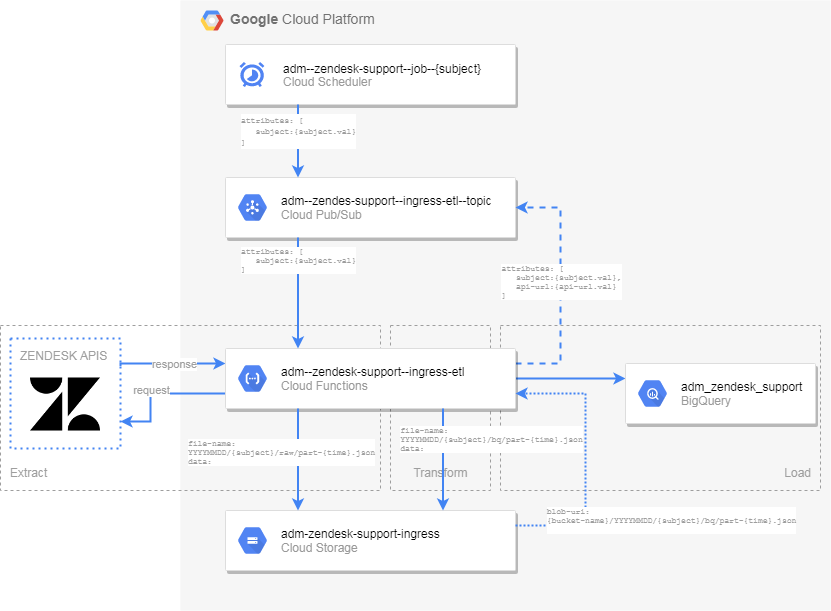

.. _infrastructure:

===================
Used infrastructure
===================

This section describes used Google Cloud Platform (GCP) services used for data transfer from Zendesk Support (via REST APIs) to data warehouse in BigQuery.

The main used services of GCP are:

* Cloud Scheduler
* Cloud Pub/Sub
* Cloud Functions
* Cloud Storage
* BigQuery

.. note:: Following text uses a term ``subject``. The world subject is generalization for all Zendesk Support entities: ``users``, ``groups``, ``organizations``, ``tickets``, ``group_membership``, ``organization_membership``

Cloud Scheduler
===============

Cloud Scheduler is used for automated triggering the data pipeline from Zendesk Support APIs to the data warehouse. The scheduling details are below:

:config_item:`google-cloud>project>scheduler>jobs`

The Cloud Scheduler job names convention is: :config_item:`solution>acronym+zendesk>data-source[glue:--,sufix:--job--{subject}]`

Cloud Pub/Sub
=============

Cloud Pub/Sub services are used to trigger the Cloud Function with with appropriate parameters. The Pub/Sub topic devote to this purpose is: :config_item:`solution>acronym+zendesk>data-source+google-cloud>project>pubsub>ingress-topic>name[glue:--]`

Cloud Functions
===============

This cloud service is used for extracting data from Zendesk Support APIs ,transforming it to the structure consumable by BigQuery and updating BigQuery dataset: :config_item:`solution>acronym+google-cloud>project>big-query>dataset>name[glue:_]`
The name of the Cloud Function for this purpose is: :config_item:`solution>acronym+zendesk>data-source+google-cloud>project>functions>ingress-etl>name[glue:--]`. This function consumes two arguments:

* subject (e.g. ``users``, ``organizations``, ``tickets``)
* zendesk-support-api-request (url to the Zendesk Support API which should be used to provide data)

If the ``zendesk-support-api-request`` is not provided the function automatically detects based on the subject + available content in the BigQuery dataset what is the right URL. Basic function run scenario is:

1. call Zendesk Support APIs to get data from Zendesk and store them in Cloud Storage in a raw format (JSON files)
2. transform raw data from Zendesk Support to prepare it for a load into BigQuery tables
3. load data into temporary table in BigQuery
4. patch records in BigQuery dataset

Cloud Storage
=============

Cloud Storage contains two buckets:

* :config_item:`solution>acronym+zendesk>data-source+google-cloud>project>storage>assets-bucket>name[glue:--]`
* :config_item:`solution>acronym+zendesk>data-source+google-cloud>project>storage>ingress-bucket>name[glue:--]`

The first bucket contains source code for the Cloud Function in a zip file ``runner.zip``. The second storage bucket is used as an archive of files from previous runs and has configured archiving policy. Objects in this bucket follow naming convention like this: ``{run-date}/{subject}/{raw/bq}/part-{run-timestamp}.json``. This convention creates following directory structure:

::

    20200714
    ├── groups
    |   ├── raw
    |   |   ├── part--2020-07-14--08:43:23+02.json
    |   |   └── part--2020-07-14--08:43:33+02.json
    |   └── bq
    |       ├── part--2020-07-14--08:43:24+02.json
    |       └── part--2020-07-14--08:43:34+02.json
    ├── users
    ├── ...
    └── organizations
    20200714
    ├── groups
    ├── ...

BigQuery
========

All the data related to the Zendesk Support are stored in the BigQuery dataset :config_item:`solution>acronym+google-cloud>project>big-query>dataset>name[glue:_]` with default table expiration :config_item:`google-cloud>project>big-query>dataset>default-table-expiration-ms` seconds.

Permanent table follows this naming pattern ``{subject}``. Temporary table are prefixed by ``__temp_``, e.g. ``__temp_users``.

========================
Data processing pipeline
========================

This section outlines generic data flow which is common for all Zendesk Support objects.

1. Data retrieval (EXTRACT)
===========================

* **[STEP 0]:** get Zendesk Support API address (if is not provided as Cloud Function parameter, it is automatically created based on subject and last update run)
* **[STEP 1]:** call Zendesk Support APIs to get data in JSON format
* **[STEP 2]:** save retrieved data in a raw format to the ingress bucket (object name pattern ``{run-date}/{subject}/raw/part-{run-timestamp}.json``)

2. Data retrieval (TRANSFROM)
=============================

* **[STEP 1]:** transform data into a format consumable by BigQuery load
* **[STEP 2]:** save transformed data in the ingress bucket (object name pattern ``{run-date}/{subject}/bq/part-{run-timestamp}.json``)

3. Update Big Query dataset (LOAD)
===================================

* **[STEP 1]:** upload data from ingress object to temporary tables in BigQuery dataset
* **[STEP 2]:** update existing tuples in subject tables
* **[STEP 3]:** insert non-existing records into subject tables
* **[STEP 4]:** drop temporary tables

